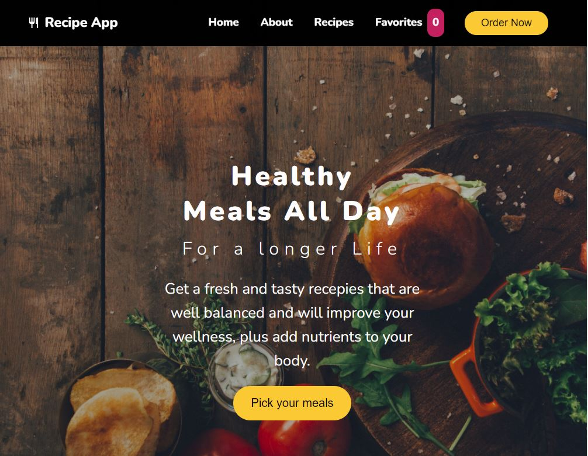
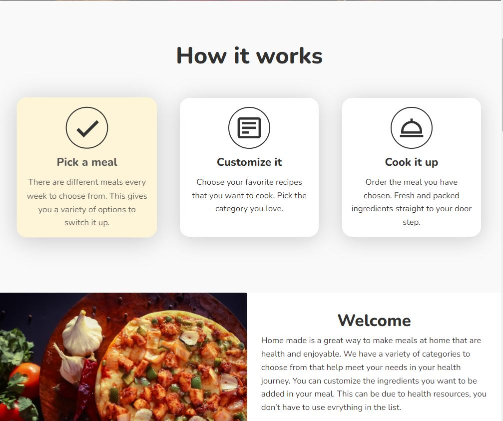
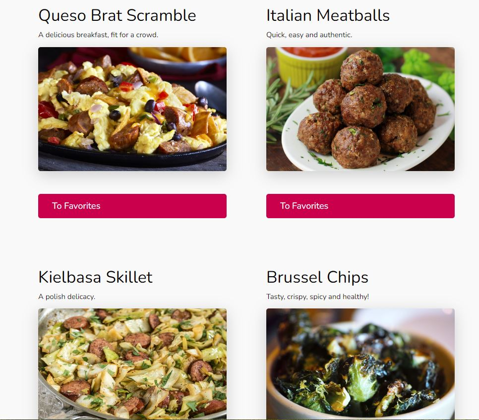
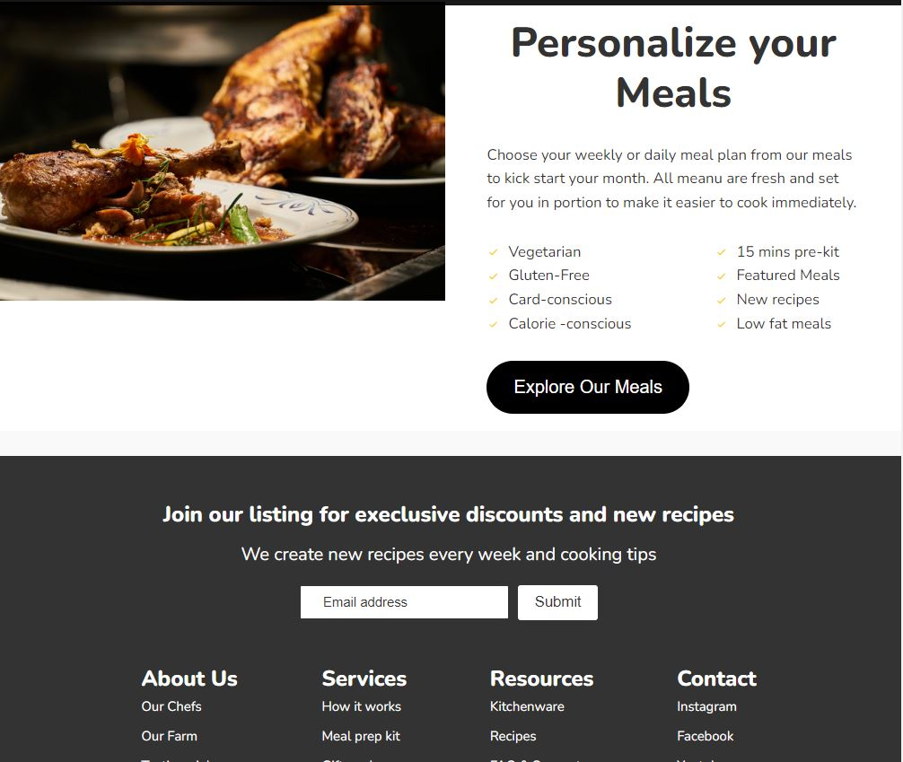

# Getting Started with Recipe App V2 🥰

This project created using `Reactjs`, `Styled Components`

## Available Scripts

In the project directory, you can run:

To install node modules you run:

### `npm install`

- To start local dev server you can run:

### `npm start`

To install and run the recipe api clone the project recipe API with two endpoints:
`http://localhost:3001/specials` and` http://localhost:3001/recipes` clone the repo using git clone . and run `npm run start:api`

## Here are some samples videos

## Here are some screenshot of the project :

Runs the app in the development mode.\
Open [http://localhost:3000](http://localhost:3000) to view it in your browser.

## Cheers Happy Coding! 🥰
